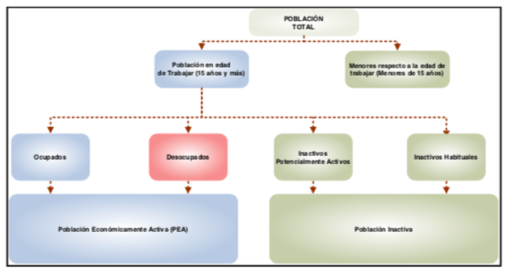

<h1> Analisis de la situacion laboral en Chile</h1>
<h2> Objectivo del trabajo<h2>
Analisar los resultados de la Encusta Nacional de Empleos, cruzando los mismos con datos socio-economicos tanto de encusta misma cuantos externos, procurando entender lo que pasa al trabajador chileno. 
<h2> Concepto y critérios de medicón</h2>
El siguiente esquema conceptual, muestra las grandes categorías en que se clasifica la población, para fines del análisis de la condición laboral. La Nueva Encuesta Nacional de Empleo se aplica a todas las personas de 15 años o más, las cuales constituyen la población en edad de trabajar (PET) en Chile. Las personas a quienes se aplica el cuestionario, pueden quedar clasificadas como ocupadas, desocupadas o inactivas, categorías mutuamente excluyentes.

La base de datos es compuesta de datos amostrales, siendo que la muestra total se distribuye en un periodo trimestral, dividiéndose en tres submuestras de un tamaño aproximadamente similar, cada una de las cuales se asigna en forma sistemática a uno de los tres meses del trimestre móvil. De esta forma se generan tres submuestras, una para cada mes, las cuales cada una por sí sola no presentan la precisión suficiente para todos los niveles de estimación.
  
Con esta distribución, cada vivienda encuestada en el mes “t” vuelve a ser encuestada en el mes “t+3” y a su vez, cada vivienda de la muestra es encuestada una vez por trimestre. Así, las estimaciones de un trimestre “t” se calculan con la información correspondiente a los meses “t-1”, “t” y “t+1”.
  
Este trabajo llevará en consideracíon multiplos trimestres, procurando una vision del cenário laboral chileno de los últimos 18 meses. 

<h2> Datasets</h2>
El dataset utilizado en este trabajo será primariamente dados (raw data) obtenidos desde la base de datos de la "Encuesta Nacional de Empleo (ENE)", desarrollada por el INE (Instituto Nacional de Estatisticas - Chile):

  http://www.ine.cl/estadisticas/laborales/ene/base-de-datos
  

Los Datos originales están en formato proprietário SPSS (.SAV)
<h3> Conversión</h3>
La base de datos deberá ser convertida al formato libre .CSV para, a partir de entonces ser trabajada en el projeto utilizando Python.
 
Para la conversion de los datos se utilisará la libreria en "R" "Foreign", la cual possue la función "read.spss" para leitura y conversion de los datos a .csv, como muestra el ejemplo abajo:
<pre>
library(foreign)
fileNameIn = "ENE_2018_01_DEF.sav"
fileNameout = "ENE_2018_01_DEF.csv"
write.table (read.spss (fileNameIn), file = fileNameout, quote = FALSE, sep = ",")
</pre>
El Jupyter Notebook utilizado para la conversion puede ser encontrado abajo:
<a href="Coverting SAV to CSV using R.ipynb">Coverting SAV to CSV using R</a>
<h3> Otros datasets</h3
La idéa será concatenar multiplos trimestres de la base del INE juntamente con otros datos tales como:

 Situación de empleo en otros paises de la America Latina 

 Datos socio economicos de Chile

<h2>Librerias</h2>
<h3> Principales librerias Python a seren utilizadas en el trabajo:</h3>
<pre>
Pandas
NumPy
MatPlotLib
</pre>
<h2> Analices preliminares (borradores) por trimestres moviles publicados en 2018</h2>

<a href="ENE_01_2018.ipynb">ENE_01_2018.ipynb</a>

<a href="ENE_02_2018.ipynb">ENE_01_2018.ipynb</a>

<a href="ENE_03_2018.ipynb">ENE_01_2018.ipynb</a>

<a href="ENE_04_2018.ipynb">ENE_01_2018.ipynb</a>

